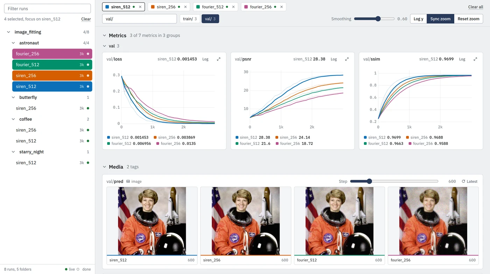

<h1>
  <picture>
    <source media="(prefers-color-scheme: dark)" srcset="assets/logo-dark.svg">
    
  </picture>
</h1>

[](https://github.com/LDenninger/ldtrain/actions/workflows/test.yml)



Log deep-learning runs as human-readable files and compare them in a local web viewer.

ldtrain adds logging to an existing training script with one `initialize()` call. Every run is a
directory of plain files, text logs, a CSV of metrics, PNG images and WebM videos, which stay
readable with `cat`, a spreadsheet or an image viewer. The optional viewer shows every run below a
directory in one dashboard.

## ✨ Features

- **Human-readable runs:** logs, metrics, images and videos are written as standard files, with no
  database and no binary event format.
- **Non-blocking logging:** console, log-file and metric writes run on background threads, so a slow
  disk or a stalled terminal does not stall a training step.
- **Distributed training:** under `torchrun` the rank is read from the environment, the NCCL
  process group is set up, each rank writes its own log file and rank 0 writes the run data.
- **Run viewer:** a browser dashboard with a nested run tree, metrics of several runs overlaid in
  one chart, smoothing, synced zoom, images and videos by step, logs and configs, updated live
  while a run trains.
- **I/O utilities:** `ldtrain.utils.files` reads and writes images, videos, JSON and YAML.

## 📦 Install

With pip:

```bash
git clone https://github.com/LDenninger/ldtrain.git
pip install -e "./ldtrain[viewer]"
```

Omit `[viewer]` in environments that only train, and use `[dev]` to also install the test tools.

With [uv](https://docs.astral.sh/uv/), either as a dependency of your project or as a checkout:

```bash
uv add "ldtrain[viewer] @ git+ssh://git@github.com/LDenninger/ldtrain"

git clone https://github.com/LDenninger/ldtrain.git && cd ldtrain
uv sync                          # package, viewer and test tools into .venv, pinned by uv.lock
uv run ldtrain-viewer runs
uv run pytest
```

### Dependencies

Python 3.12 or newer. PyTorch, NumPy, OpenCV, PyYAML and OmegaConf are installed as dependencies.
The viewer adds FastAPI and uvicorn.

## 🚀 Usage

```python
import numpy as np

import ldtrain

ldtrain.initialize(run_dir='runs/demo/lr1e-3')

for step in range(2000):
    loss = 1.0 / (step + 1)
    ldtrain.log_metrics({'train/loss': loss, 'train/lr': 1e-3}, step=step)
    if step % 1000 == 0:
        prediction = np.random.rand(64, 64, 3)          # (H, W, 3), uint8 or float in [0, 1]
        rollout = np.random.rand(8, 64, 64, 3)          # (T, H, W, 3)
        ldtrain.log_images({'val/pred': prediction}, step=step)
        ldtrain.log_videos({'val/rollout': rollout}, step=step)
        ldtrain.info(f'step {step}: loss {loss:.4f}')

ldtrain.finish()
```

Wrap the parts that may fail in `catch_exceptions()`. An exception inside is logged with its
traceback, then the run stops cleanly, or continues when `critical=False`:

```python
@ldtrain.catch_exceptions(critical=False)   # log and carry on, the call returns None
def validate(model, step): ...

with ldtrain.catch_exceptions():            # log, finish() and exit with status 1
    for step in range(2000):
        train_step(model)
        validate(model, step)
```

When guards are nested, the innermost one decides: an outer guard never sees an exception an inner
one already handled.

### Viewer

```bash
ldtrain-viewer runs        # or: python -m ldtrain.viewer runs
```

Open `http://localhost:8765`, or pick another port with `--port`. The viewer binds to localhost
only. To use it on a remote machine, forward the port with `ssh -L 8765:localhost:8765 <host>`.

## 📁 Run directory

```
runs/demo/lr1e-3
├── checkpoints                 # your model checkpoints, not written by ldtrain
├── configs                     # your config files, shown by the viewer (.yaml, .yml, .json, .txt)
├── logs
│   ├── log.txt                 # console log of rank 0
│   └── log.rank<r>.txt         # console log of rank r > 0
├── metrics
│   └── metrics.csv             # one row per iteration, one column per metric
└── visuals
    └── 00001000                # one folder per iteration that logged media
        └── val
            ├── pred.png
            └── rollout.webm    # VP8, plays in every current browser
```

ldtrain writes `logs`, `metrics` and `visuals`. After `initialize()`, the paths of all five folders
are available as `ldtrain.run.checkpoint_dir`, `config_dir`, `log_dir`, `metrics_dir` and
`visual_dir`, so checkpoints and configs can be saved into the run as well.

`metrics.csv` loads with `pandas.read_csv('runs/demo/lr1e-3/metrics/metrics.csv', index_col='iteration')`.

## 🧩 API

Everything a training script needs is exported at the package root.

| Name | Purpose |
|---|---|
| `initialize(run_dir=None, use_distributed=None, ...)` | Open the run: log file, metrics CSV, visuals folder and, under `torchrun`, the NCCL process group |
| `finish()` | Flush and close everything `initialize()` opened |
| `catch_exceptions(critical=True)` | Decorator or context manager: log an exception, then stop the run cleanly, or continue when not critical |
| `info`, `warning`, `error`, `critical`, `debug`, `dev`, `log_config` | Console and log-file messages |
| `log_metrics`, `log_images`, `log_videos` | Run data at a given step, written by rank 0 |
| `run` | The run's directories: `root_directory`, `log_dir`, `metrics_dir`, `visual_dir`, `checkpoint_dir`, `config_dir` |
| `dist` | Process rank and world size: `rank`, `local_rank`, `world_size`, `is_master`, `initialized` |
| `barrier()`, `distributed_barrier()` | Synchronize ranks, no-ops without a process group |
| `Config`, `RunConfig`, `DistributedConfig` | Dataclass configs with YAML, JSON and argparse loaders |

The subpackages hold the implementation: `ldtrain.log` writes runs, `ldtrain.viewer` reads and
serves them, and `ldtrain.utils` holds the file and image helpers.

## 🤝 Contributing

Questions and bug reports go to the [GitHub issues](https://github.com/LDenninger/ldtrain/issues).
Pull requests are welcome, and larger changes are best discussed in an issue first. Every push and
pull request runs the suite on Python 3.12 and 3.13, and a `v*` tag builds the wheel and publishes
a GitHub release.

### Testing

```bash
uv sync                                          # test tools included
uv run playwright install chromium               # once, for the browser tests
uv run pytest                                    # everything, about 30 s
uv run pytest -m "not browser and not multiprocess"   # the fast core, about 2 s
uv run pytest --cov=ldtrain --cov-report=term-missing
```

Tests live in `ldtrain/tests/`, one file per module. `conftest.py` writes a small run tree through
the public API that the reader, server and browser tests share. Browser tests drive the viewer in
headless Chromium, and the `multiprocess` tests start two ranks with a gloo process group, so both
run on a CPU-only machine. By submitting a
contribution you agree that it is licensed under this project's license and may be included in
commercial licenses granted by the licensor.

## 📄 License

[PolyForm Noncommercial 1.0.0](LICENSE) (`PolyForm-Noncommercial-1.0.0`) © 2026 Luis Denninger

Personal, research, educational and other noncommercial use is permitted under the license
terms. Commercial use requires a separate license: contact luis.denninger@gmail.com.
